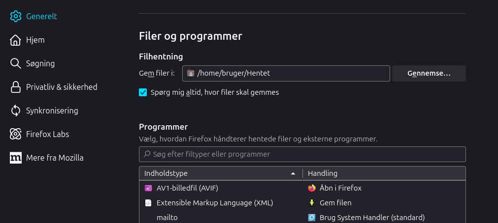
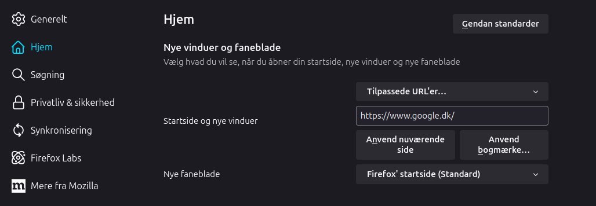

# Ubuntu 24.04 after Installations

## Update

```code
sudo apt update && sudo apt full-upgrade && sudo apt autoremove
```

## Add some Directory

```code
mkdir -p ~/.local/bin && mkdir -p ~/.local/share/icons
```

## Firefox settings

* Generelt
  * Filhentning
    * Enable: Spørg mig altid, hvor filer skal gemmes
* Hjem
  * Startside og nye vinduer
    * Tilpassede URL'er..: https://www.google.dk/
    * Click: Anvend nuværende side

|Generelt|Hjem|
|:---:|:---:|
|||

## Change to X11 from Wayland

```code
sudo nano /etc/gdm3/custom.conf
```

* Within this file, look for the line that says #WaylandEnable=false. You can uncomment this line and either set it to true or false, depending on whether you want Wayland enabled or not.  

* Disable Wayland:

```text
WayLandEnable=false
```

* Save and Exit nano
  * To Save: [Ctrl]+[o]
  * To Exit: [Ctrl]+[w]

* After you have made the desired changes, save this file and exit it. You will need to restart GDM3 or reboot your Ubuntu 22.04 desktop for the changes to take effect.

```code
sudo systemctl restart gdm3
```

## ESPHome interface for ESP32 MCU

```code
sudo usermod -a -G dialout $USER
```

## Some nice to have Programs

### APT

```code
sudo apt install -y rpi-imager geany gparted putty filezilla fritzing dia handbrake brasero solaar 
```

### Snap

```code
sudo killall snap-store && sudo snap refresh
```

```code
sudo snap install pinta telegram-desktop
```

## AppImage

* [./AppImages.md](./AppImages.md)
  * [Where to place my AppImages files](./AppImages.md#where-to-place-my-appimages-files)
  * [AppImages Fuse](./AppImages.md#appimages-fuse)
  * [AppImages App](./AppImages.md#appimages-app)
  * [AppImages Icons](./AppImages.md#appimages-icons)
  * [AppImages Desktop Files](./AppImages.md#appimages-desktop-files)
    * [FreeCAD 0.22.0dev-Linux-x86_64](./AppImages.md#freecad-0220dev-linux-x86_64)
    * [UltiMaker-Cura-55.8.0-linux-X64](./AppImages.md#ultimaker-cura-5580-linux-x64)
    * [Kdenlive](./AppImages.md#kdenlive-ver-24080)
  * [How to make AppImage run as a Program](./AppImages.md#how-to-make-appimage-run-as-a-program)

### LaserWeb/CNCWeb (linux free alternative to lightburn)

* Lightburn:
  * [Lightburn Linux support Ending](https://forum.lightburnsoftware.com/t/linux-support-ending/144618)
* LaserWeb/CNCWeb (linux free alternative to lightburn)
  * [https://github.com/LaserWeb/LaserWeb4/wiki](https://github.com/LaserWeb/LaserWeb4/wiki)
  * [https://github.com/LaserWeb/LaserWeb4/wiki/1.3-Installation-on-Linux](https://github.com/LaserWeb/LaserWeb4/wiki/1.3-Installation-on-Linux)
  * [My Short guide](./LaserWeb-CNCWeb.md)

## Video Record, Screencast your keys and Edit

* [./VideoRecEdit.md](./VideoRecEdit.md)
  * [OBS-Studio](./VideoRecEdit.md#obs-studio)
  * [Screencast your keys](./VideoRecEdit.md#screencast-your-keys)
  * [Kdenlive](./VideoRecEdit.md#kdenlive) Use Appimages version

## Samba setup

* [./SambaSetup.md](./SambaSetup.md)
  * [Install Sanba](./SambaSetup.md#install-sanba)
  * [Directory to share files from](./SambaSetup.md#directory-to-share-files-from)
  * [Config Samba](./SambaSetup.md#config-samba)
  * [Edit /etc/samba/smb.conf](./SambaSetup.md#edit-etcsambasmbconf)
  * [Set Samba password](./SambaSetup.md#set-samba-password)
  * [Restart Samba](./SambaSetup.md#restart-samba)

